**# ABC-ENGLISH**
**## Overview**
This project is an e-learning platform built using Spring Boot with a client-server architecture. The system provides functionalities for user registration, managing courses, tracking progress, and interactive features like messaging and forums.
**## Architecture**
### Client-Server Model
- Client: Handles user interactions and sends requests to the backend.
- Server (Spring Boot): Processes business logic, manages data storage, and provides RESTful APIs.
**## Features**
### User Registration and Login
The registration process includes a two-step verification mechanism to ensure account security and authenticity. Here's how it works:
#### User Registration Form
- The user fills out the registration form with their email and other required information.
- The system validates the submitted details and saves the user as "unverified" in the database.
#### Verification Email
- After the user submits the registration form, the system sends an email to the provided address.
- The email contains a verification link with a unique token
### Profile Management
Users can update personal information and track their learning progress.
### Course List
Displays available courses categorized by:
        + Level: Beginner, Intermediate, Advanced.
        + Topics: Grammar, Vocabulary, Pronunciation.
### Diverse Learning Materials
Includes teaching videos, PDF documents, online exercises, and quizzes.
### Assignments and Tests
Enables users to practice with assignments and tests after each chapter.
### Discussion Forum
Provides a space for students and teachers to discuss and resolve queries.
### Messaging
Allows students to directly message teachers for advice or questions.
### Automated Grading
Automatically evaluates grammar-based text questions.
### Notifications and Reminders
Sends alerts for new lessons and reminders for pending assignments.

# CyberSecurityBackEnd
# **ABC-ENGLISH**

## **Overview**
ABC-ENGLISH is an e-learning platform built using Spring Boot with a client-server architecture. The system provides functionalities for user registration, course management, tracking progress, and interactive features like messaging and forums.

## **Architecture**

### **Client-Server Model**
- **Client:** Handles user interactions and sends requests to the backend.
- **Server (Spring Boot):** Processes business logic, manages data storage, and provides RESTful APIs.

## **Features**

### **User Registration and Login**
The registration process includes a two-step verification mechanism to ensure account security and authenticity.

1. The user fills out the registration form with their email and other required information.
2. The system validates the submitted details and saves the user as "unverified" in the database.

#### **Verification Email**
- After submitting the registration form, the system sends a verification email to the provided address.
- The email contains a verification link with a unique token.

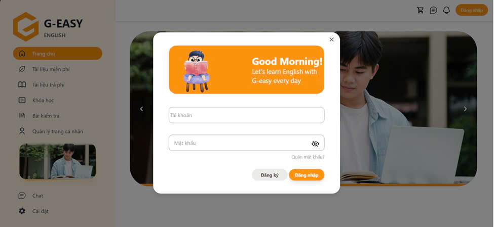

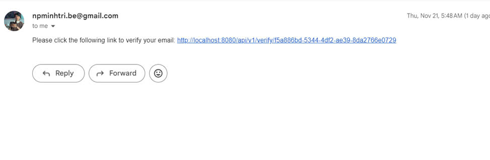

### **Profile Management**
Users can update their personal information and track their learning progress.

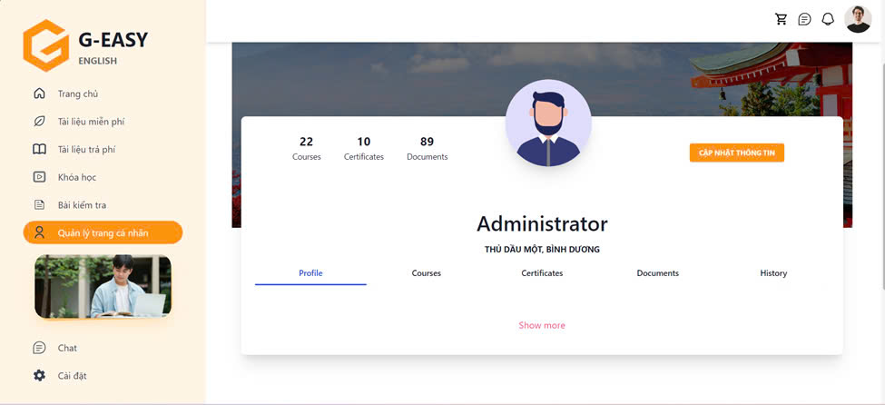

### **Course**
The course is designed to help learners improve their English language skills from beginner to advanced levels. It covers essential vocabulary, grammar, reading, writing, listening, and speaking skills. The interactive lessons, quizzes, and exercises ensure a well-rounded learning experience.

- **Categories:**
  - **Level:** Beginner, Intermediate, Advanced.
  - **Topics:** Grammar, Vocabulary, Pronunciation.

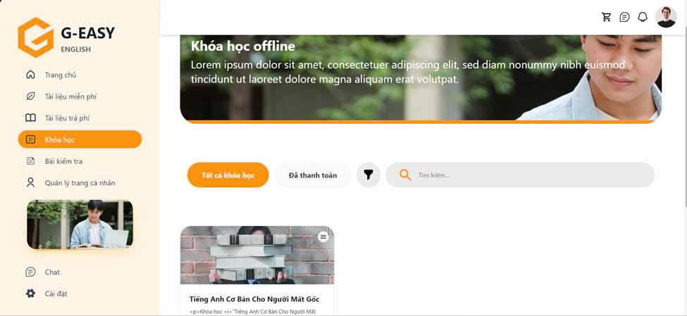
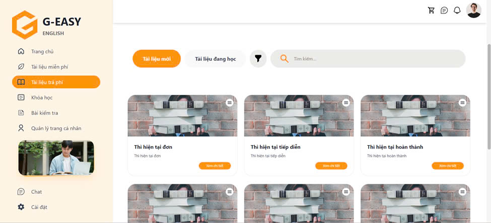
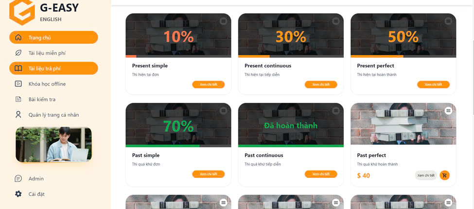
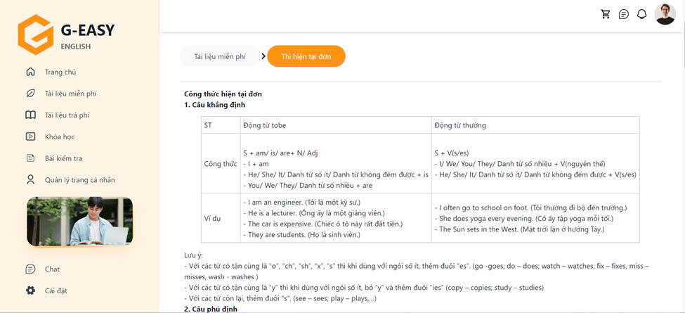
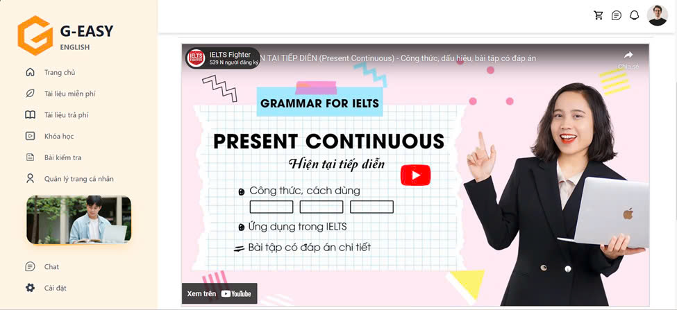

### **Course Detail**
This course provides a comprehensive learning experience, combining text-based lessons and video tutorials to cater to different learning preferences. The course is organized into chapters, each covering specific topics with a mix of theory and practice. Learners will engage in various exercises and quizzes to test their understanding and reinforce what they've learned.

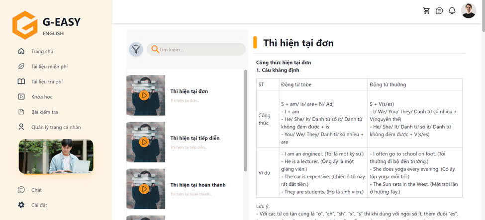
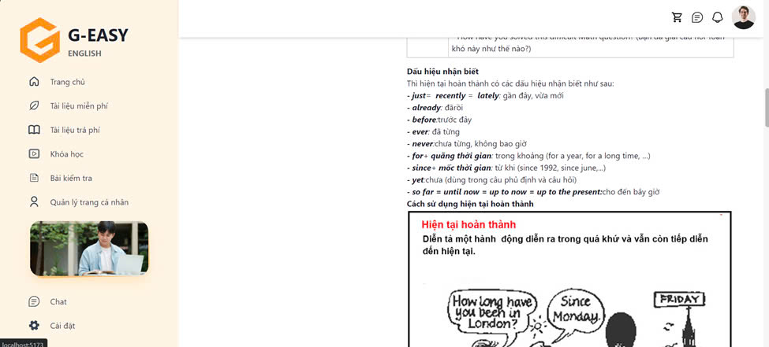
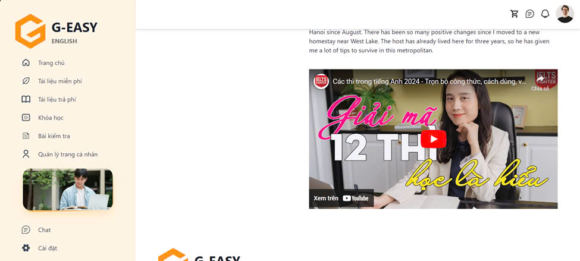

### **Test**
The Automatic Grading feature allows learners to receive instant feedback on their written submissions. When a user submits a text-based response, the system automatically analyzes the content for grammar, spelling, and punctuation errors. This feature aims to help learners identify common mistakes and improve their writing skills.

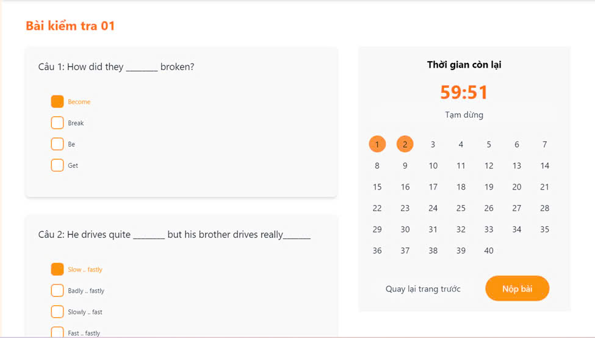
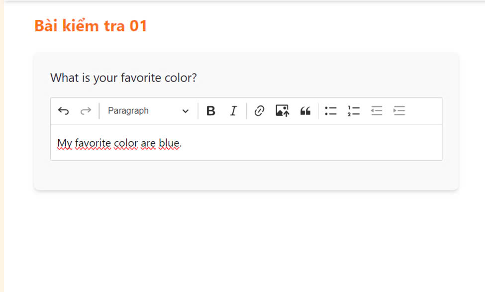
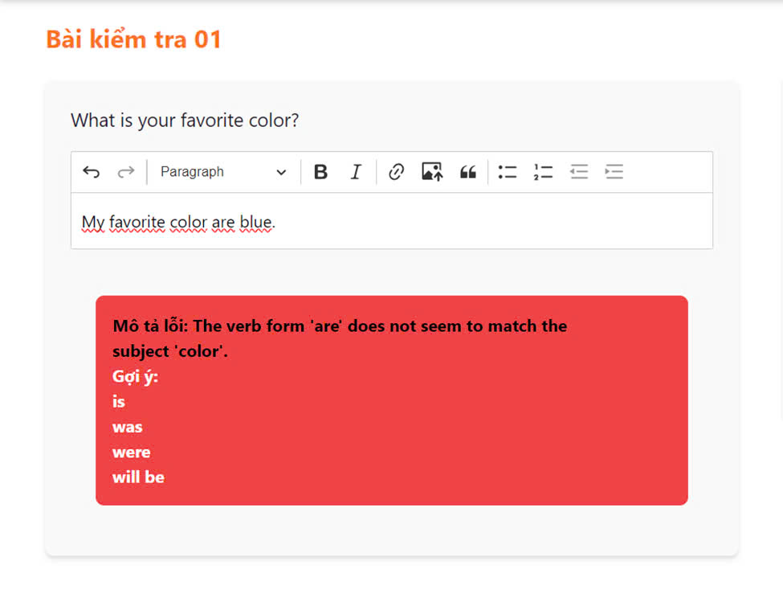
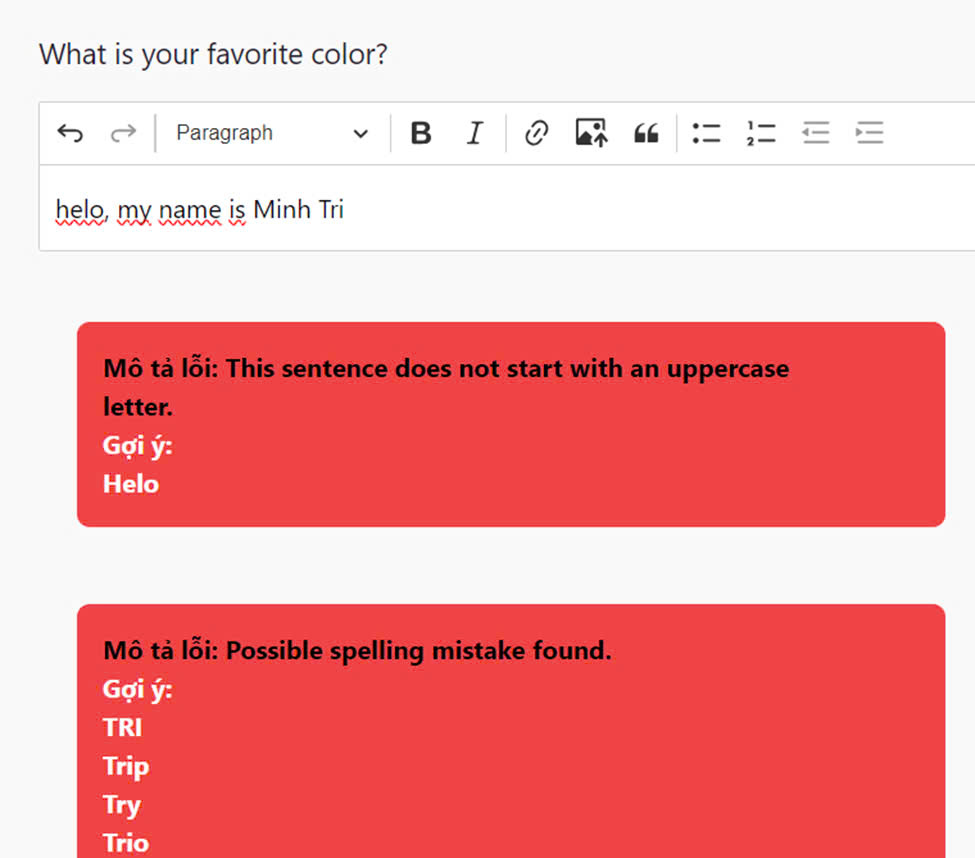

## **Setup Instructions**

### **Prerequisites**
- Java JDK 17 or higher
- Maven installed
- Spring Boot dependencies
### ***Setup Database (SQL Server)***
#### **Step 1: Create the Database**
To set up the database for this project:

1. Open **SQL Server Management Studio (SSMS)**.
2. Connect to your SQL Server instance.
3. Create a new database using the following SQL query:
   ```sql
   CREATE DATABASE EducationSystem1;
**Step 2: Configure Database Connection in application.yaml**
After creating the database, you need to configure the connection to SQL Server in your Spring Boot project. Modify the application.yaml file to include the connection details for the database.

Open the application.yaml file located in the src/main/resources folder of your project.
Update the database connection configuration as follows:

### **Steps to Run the Project**
1. **Clone the repository:**
   ```bash
   git clone https://github.com/Min-Trees/Backend_ABC_English.git
   cd <project-folder>
2. **Install dependencies**
   ```bash
   mvn clean install


